# Formation RxJS

https://slides.com/mania06/rxjs

## Sommaire

* Présentation RxJS, contexte, utilité, pourquoi
* Observable
    * Représentation (marbles)
    * Définition
        * Next
        * Error
        * Complete
    * Ecouter observable
    * Créer un Observable
        * new Observable();
        * from
        * of
        * interval
        * throwError
        * NEVER
        * EMPTY
* Subscription
    * Unsubscription with example
    * Différence hot/cold: https://medium.com/@benlesh/hot-vs-cold-observables-f8094ed53339
* Operators

## RxJS: pourquoi?
RxJS = librairie de reactive programming. Sert à manipuler un flux (= Observable)

## Un Observable: c'est quoi?
### Elements atomiques
Un observable est composé de 3 type d'éléments

#### Une ou plusieurs valeurs
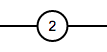

#### Une erreur
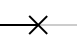

#### Une fin (completion)
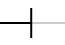

### Exemples
Voici 2 examples d'Observable:
* Un Observable qui envoie 4 valeurs et qui finit


* Un Observable qui envoie 3 valeurs et qui emet une erreur
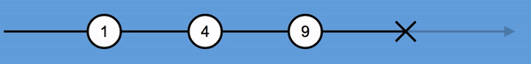

* Un Observable défini en TypeScript qui envoie 3 valeurs et qui finit
```typescript
const myTimer$ = interval(1000).pipe(take(3));
```
Ce qui a comme représenation
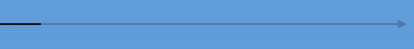

## Les Subscriptions: comment écouter un Observable? 

Le type `Observable` possède une méthode `subscribe()` qui permet d'écouter les différents évènements se produisant à l'intérieur

```typescript
source$.subscribe(
   value => console.log(value),
   err => console.log('error'),
   () => console.log('completed')
);
```

Par exemple, avec cet Observable comme source$ 


Le résultat serait le suivant en console:
```typescript
// 0
// 1
// error
```

## Dieu créa l'Observable

Créer un observable permet de gérer ce qui sera émit par celui-ci: la ou les valeurs (ou aucune), l'erreur ou la completion.
Il est tout a fait possible pour un observable de ne jamais finir ou d'avoir d'erreur

### Manuellement
Il est possible de créer un observable "manuellement" en utilisant le constructeur de Observable. 
Il est rare d'utiliser ce pattern car beaucoup d'autres méthodes existent pour générer des observables. 

```typescript
new Observable(observer => {
  observer.next('A');
 
  setTimeout(() => observer.next('B'), 1000);
  setTimeout(() => observer.next('C'), 2000);
  setTimeout(() => observer.complete(), 4000);
});
```

L'Observable créé pourra être représenté de la manière suivante:
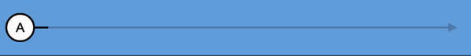

En réutilisant l'appel à `subscribe` d'au dessus, on obtiendrait :
```typescript
// A
// B
// C
// completed
```

### Générateurs
Pour éviter de créer manuellement un observable, plusieurs méthodes existent dans RxJS. En voici quelques examples:

| Code              | Description                                  | Representation                                           |
|-------------------|----------------------------------------------|----------------------------------------------------------|
| `NEVER`           | Observable that "never emit value            | 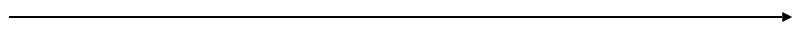             |
| `EMPTY`           | Observable that complete imediatly           | 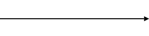             |
| `of('A')`         | Observable that emit a value, then complete  | 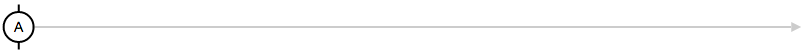                 |
| `intervall(1000)` | Observable that emit a value every x seconds | 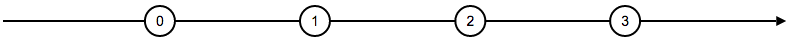     |
| `throwError({})`  | Observable that throw an error               | 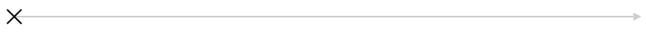 |

See also http://rxmarbles.com/ for more examples.

## Subscriptions

La méthode `subscribe` retourne une `Subscription` qui permet à l'utilisateur de `unsubscribe()` lorsque celui-ci ne souhaite plus recevoir les updates 

Un des cas d'utilisation serait par exemple pour relacher une ressource$ qui n'est plus necessaire :

```typescript
const subscription = twitterFeed.subscribe(tweet => console.log(tweet)); // Listen to tweet feed

// Later

subscription.unsubscribe(); // Stop listening tweets
```

Pour créer un observable avec un mécanisme de teardown (action lors du unsubscribe), il faut utiliser le constructeur d'Observable: 

```typescript
new Observable(observer => {
    // ...
    
    return () => tearDownLogic();
});
```

## Operateurs

Il est aussi possible de générer un Observable à partir d'un autre. Pour cela on utilise les opérateurs.
Pour appliquer un opérateur à un observable afin d'en créer un autre, il faut le passer en paramètre à la méthode `pipe()` fournie par RxJS.

Here is an example with the `map` operator :
```typescript
const source$ = of('A');

const result$ = source$.pipe(map(...));
```

In most cases (I will come back on that later), when you subscribe to the resulting Observable, the operator forward the subscription to the source$ Observable.
Unsubscriptions are also forwarded.

To use more than one operator, just add it to the `pipe()`.

```typescript
const source$ = of('A');

source$.pipe(
    operator1(),
    operator2(),
    operator3(),
    ...
);
```

### Map

The `map(...)` operator is one of the most used.
Each time the source$ emit a value, this value is given to the callback function given in parameter and emit the resulting value.
The error or completeness is forwarded from the source$ to the resulting observable.

```typescript
const source$ = interval(1000); // Emit a value every seconds: 0, 1, 2, 3, ...

const result$ = source$.pipe(
    map(x => 10 * x)
) 
// result$ will emit 0, then 10, then 20, then 30, ...
```

### Filter

The `filter(...)` operator will create an observable from a source$ and select the emitted value from the source$ it want to emit aswell.


```typescript
const source$ = interval(1000); // Emit a value every seconds: 0, 1, 2, 3, ...

const result$ = source$.pipe(
    filter(x => x%2 === 0) // Filter only odd values
)

// result$ will emit 0, 2, 4, ...
```

### First

The first operator will simply only emit the first value from the source$ observable.

```typescript
const source$ = interval(1000); // Emit a value every seconds: 0, 1, 2, 3, ...

const result$ = source$.pipe(
    first()
) 

// result$ will emit 0, then complete.
```

Note: When subscribing to the result$ Observable, the first operator will subscribe the subscription to the source$ Observable, then when the first value is emitted, the operator will emit that value, then unsubcribe to the source$ Observable and complete itself. 

### And many more

There is a lot more operators described [here](http://reactivex.io/documentation/operators.html)  
And [here](https://rxmarbles.com/) is a good operator list with cool and understandable design

## High-order Observables


## Subject

## Multicasting
